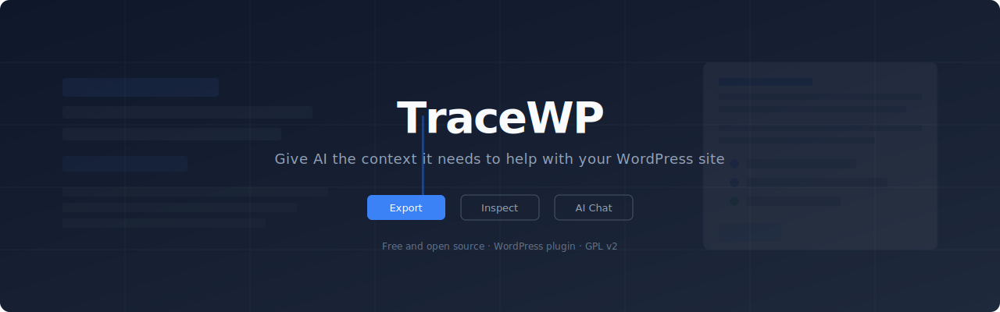
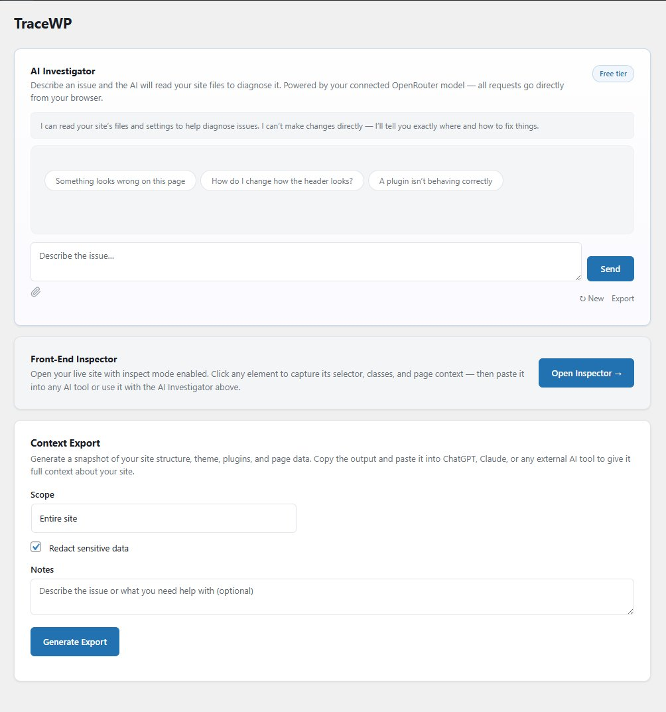
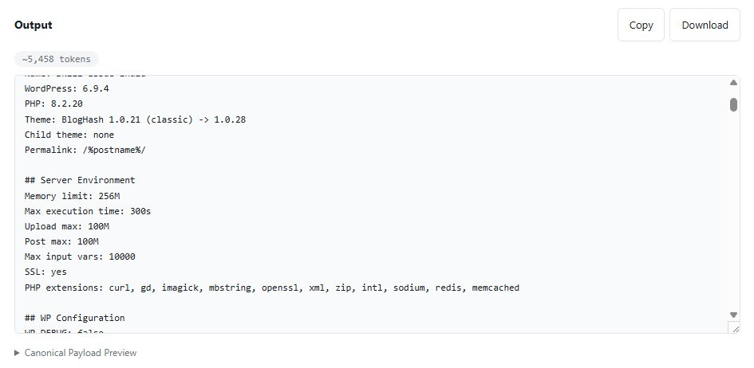
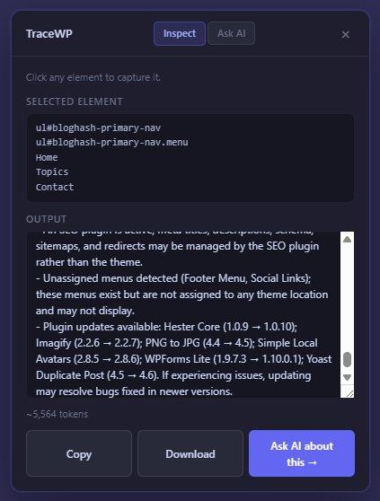
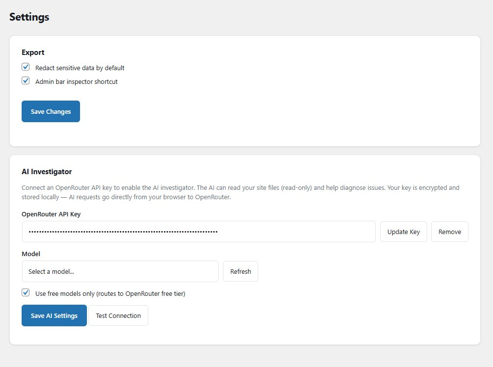

<p align="center">
  
</p>

<p align="center">
  <a href="https://www.php.net/releases/7_4_0.php"></a>
  <a href="https://wordpress.org/download/"></a>
  <a href="LICENSE"></a>
</p>

**Give AI the context it needs to actually help with your WordPress site.**

TraceWP packages your site's full technical context into a single AI-ready export — theme, plugins, server environment, customizer settings, menus, cron jobs, debug log, and more. Paste it into ChatGPT, Claude, or any LLM and skip the back-and-forth.

Also includes a built-in AI investigator (bring your own OpenRouter key) that can read your site files directly and suggest fixes from your dashboard.

---

## The problem

When you ask AI for help with your WordPress site, it doesn't know anything about your setup:

> *"What theme are you using?"*
> *"What plugins do you have?"*
> *"What version of PHP?"*
> *"Can you show me the HTML?"*

TraceWP eliminates that. One click gives the AI everything.

## Features

### Context export — no API key needed

- **One-click site context** with 15+ data points — theme, plugins, server environment, wp-config constants, .htaccess, customizer settings, menus, widgets, cron, debug log, and more
- **Front-end inspector** — click any element on your live site to capture its selector, classes, and context
- **Markdown output** with role instructions and table of contents — paste directly into any AI tool
- **Safe export mode** — redacts emails, phone numbers, and external URLs
- **Token estimate** so you know how much context window you're using

### AI investigator — optional, requires OpenRouter key

- **Built-in chat** in admin dashboard and front-end inspector
- **7 read-only tools** — read files, list directories, search code, check options, fetch HTML, trace templates, list theme files
- **Streaming responses** with tool-call transparency
- **Image support** — paste screenshots for visual diagnosis
- **Free model support** via OpenRouter's free tier

## Screenshots

<p align="center">
  
</p>
<p align="center"><em>Admin dashboard — AI Investigator, Front-End Inspector, and Context Export</em></p>

<p align="center">
  
</p>
<p align="center"><em>Export output — server environment, wp-config, theme data and more, ready to paste</em></p>

| | |
|---|---|
| <br><em>Front-end inspector — click to capture any element</em> | <br><em>Settings — API key encryption, model selection, free tier</em> |

## What's in the export

The context export includes everything an AI needs to help without asking follow-up questions:

| Category | Data |
|---|---|
| **Site** | Name, WordPress version, PHP version, permalink structure |
| **Theme** | Name, version, type (classic/block), child theme status, pending updates |
| **Customizer** | Full theme_mods dump — colors, fonts, layout settings |
| **Plugins** | All active plugins with versions and pending updates |
| **Server** | Memory limit, max execution time, upload max, PHP extensions, SSL, object cache |
| **Configuration** | wp-config.php constants (WP_DEBUG, WP_CACHE, DISALLOW_FILE_EDIT, etc.) |
| **Content** | Post counts by type, page template, block inventory, front page type |
| **Menus** | Full menu structure with items, hierarchy, and location assignments |
| **Widgets** | Widget areas and their contents |
| **Cron** | Scheduled tasks with timing, overdue warnings, DISABLE_WP_CRON detection |
| **Shortcodes** | All registered shortcodes with source identification |
| **Image sizes** | Registered sizes with dimensions and crop settings |
| **Hooks** | Non-core callbacks on wp_head, wp_footer, init, wp_enqueue_scripts |
| **Template overrides** | WooCommerce/plugin templates overridden in the theme |
| **.htaccess** | Full file contents |
| **Debug log** | Last 30 lines if WP_DEBUG is on |
| **REST API** | Accessibility check |

## Security

- **Read-only** — never writes to files or the database
- **API keys encrypted** with AES-256-CBC (OpenSSL required — no insecure fallback)
- **Keys fetched via AJAX** — never appear in HTML source
- **File access jailed** via `realpath()` — no path traversal
- **wp-config credentials** automatically redacted
- **Sensitive options blocked** (passwords, secrets, tokens, keys, salts)
- **`.env` files blocked** entirely
- **AI output HTML-escaped** to prevent XSS
- **Rate limited** — 60 tool calls per minute
- **Administrator only** — all endpoints require `manage_options`

## Installation

1. Download the [latest release](../../releases/latest) or clone this repository
2. Upload the `tracewp` folder to `wp-content/plugins/`
3. Activate through the WordPress Plugins screen
4. Open **TraceWP** in the admin sidebar

For the AI Investigator, add an OpenRouter API key in **TraceWP → Settings**. Free models are enabled by default.

## Requirements

- WordPress 6.4+
- PHP 7.4+
- OpenSSL extension (required for API key encryption; AI investigator is disabled without it)

## File structure

```
tracewp/
├── tracewp.php                        Main plugin file
├── assets/
│   ├── css/
│   │   ├── admin.css                  Admin dashboard styles
│   │   └── inspector.css              Front-end inspector styles
│   └── js/
│       ├── admin.js                   Admin page logic + settings
│       ├── inspector.js               Front-end element inspector
│       └── investigate.js             Reusable AI chat factory
├── includes/
│   ├── class-pt-admin.php             Admin pages and asset enqueuing
│   ├── class-pt-ai-controller.php     REST endpoints for AI tools
│   ├── class-pt-ai-tools.php          7 read-only tool implementations
│   ├── class-pt-crypto.php            AES-256-CBC key encryption
│   ├── class-pt-detector.php          Theme/plugin type detection
│   ├── class-pt-environment-collector.php  Server, config, cron, debug log
│   ├── class-pt-formatter.php         Markdown output formatting
│   ├── class-pt-inspector.php         Front-end inspector bootstrap
│   ├── class-pt-page-collector.php    Page data (content, blocks, meta)
│   ├── class-pt-payload-builder.php   Context payload assembly
│   ├── class-pt-plugin.php            Plugin bootstrap
│   ├── class-pt-rest-controller.php   REST endpoints for export
│   ├── class-pt-security.php          Capability checks, rate limiting
│   ├── class-pt-settings.php          Settings + API key AJAX handlers
│   ├── class-pt-site-collector.php    Site data + extended collectors
│   └── class-pt-support.php           Sanitization, redaction, utilities
└── templates/
    ├── export.php                     Main plugin page
    ├── partials-investigate.php       AI investigator panel
    ├── partials-output.php            Export output panel
    └── settings.php                   Settings page
```

## Changelog

### 1.0.0

First stable public release.

- Context export with 15+ data points
- Markdown output with table of contents
- Front-end element inspector
- AI investigator with 7 read-only tools
- OpenRouter integration with free tier support
- API keys encrypted with AES-256-CBC (OpenSSL required)
- AI output HTML-escaped before rendering
- File access jailed to ABSPATH

### 0.9.0

Pre-release. AI investigator, front-end inspector with embedded chat, OpenRouter integration.

### 0.5.0

Pre-release. Context export with site, page, and element scope. Front-end element inspector.

### 0.1.0

Initial development. Basic site context export with plugin and theme detection.

## Contributing

See [CONTRIBUTING.md](CONTRIBUTING.md) for development setup, coding standards, and PR guidelines.

To generate translation files: `wp i18n make-pot . languages/tracewp.pot`

## License

GPL v2 or later. See [LICENSE](LICENSE).

## Author

Built by [Belletty Digital](https://belletty.com).
